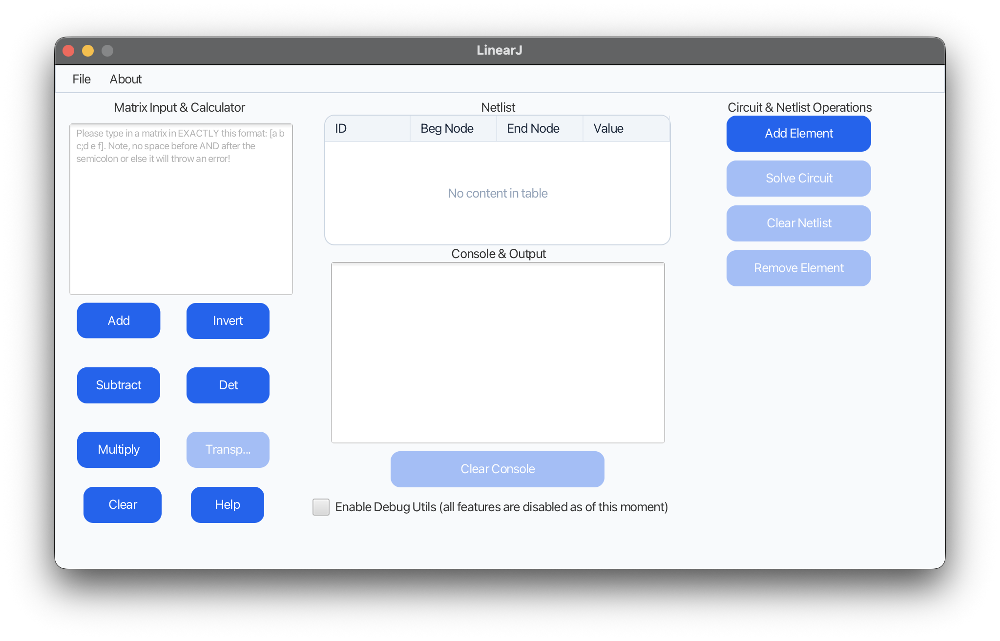
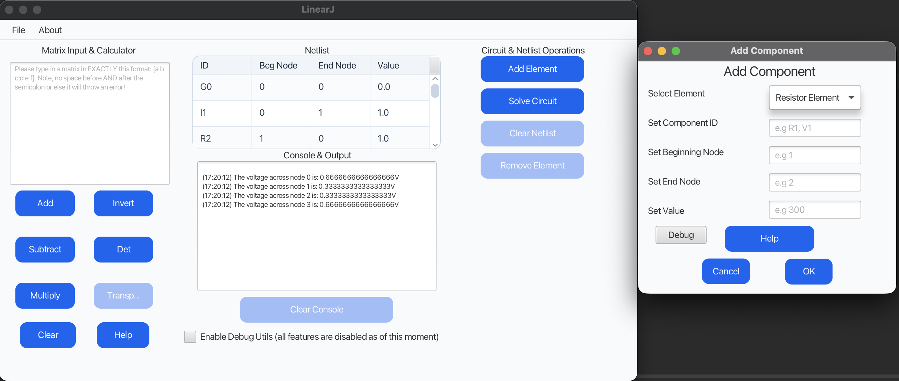
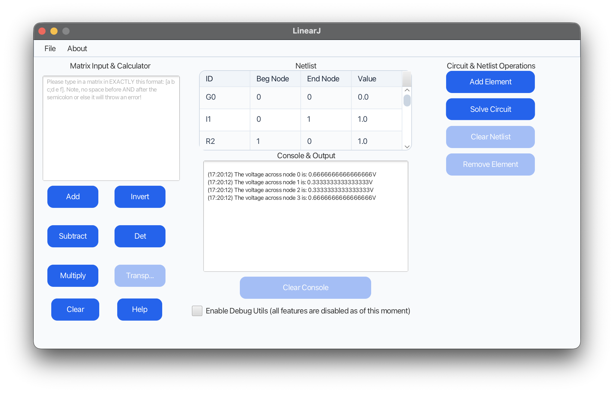

# LinearJ

LinearJ is a desktop (soon CLI only interface!) matrix calculator and experimental DC circuit solver written in Java. It combines a JavaFX interface with linear-algebra routines and a circuit model based on **modified nodal analysis (MNA)**.

> [!IMPORTANT]
> This project is incomplete.

## Screenshots

### Matrix calculator and netlist workspace



### Adding a circuit component

)

### Current workspace snapshot



## What to expect?

- Desktop interface (CLI only interface soon...)
- Matrix addition, subtraction, multiplication, inversion, determinant, and transpose
- A text format for entering one or two matrices
- A netlist table and an add-component dialog

## Theory

### Matrices and linear systems

Many engineering problems can be expressed in the form:

```text
A x = b
```

Here, `A` stores the coefficients of the problem, `x` contains the unknown values, and `b` contains the known inputs. LinearJ includes general matrix operations as well as LU decomposition, which factors a square matrix into lower- and upper-triangular matrices so the system can be solved efficiently by forward and back substitution.

### Modified nodal analysis

Nodal analysis applies Kirchhoff's Current Law (KCL): the algebraic sum of currents at each node is zero. For a resistor between nodes `i` and `j`, its conductance `g = 1/R` contributes to the circuit matrix as:

```text
 A[i][i] += g       A[i][j] -= g
 A[j][j] += g       A[j][i] -= g
```

Current sources contribute to the right-hand-side vector. Ideal voltage sources require extra unknown currents and extra rows and columns, which is the modification in **modified** nodal analysis. After every component has “stamped” its contribution into the global matrix and vector, LinearJ solves the resulting system to obtain node voltages and voltage-source currents.

This design is reflected in the code: circuit elements know how to stamp themselves, while `CircuitSolver` assembles the system and `LUDecomposition` performs the numerical solve.

## Cool, now how do I get my own LinearJ?

### Requirements

- JDK 21
- Git
- macOS, Linux, or Windows with a graphical desktop (Windows & Linux have not been tested by me, mileage may vary.)

Maven does not need to be installed separately because the repository includes the Maven Wrapper.

### Run from source

```bash
git clone https://github.com/chilldotrelax/LinearJ.git
cd LinearJ
./mvnw javafx:run
```

On Windows, use `mvnw.cmd javafx:run` instead.

To compile and run the test suite:

```bash
./mvnw clean verify
```

## Matrix input format

Enter a matrix inside square brackets. Separate values in a row with spaces and separate rows with a semicolon:

```text
[1 2;3 4]
```

Operations that take two matrices should be separated by `/`:

```text
[1 2;3 4]/[5 6;7 8]
```

Unfortunately, the parser is slightly strict about formatting, this will be fixed as soon as possible.

There are internal help guides inside the application if you so need it.

## Project structure
```text
src/main/java/org/andy/linearj/
├── Circuit/             Circuit elements, nodes, factory, and solver
├── Maths/               Matrix utilities and LU decomposition
├── Screen/controllers/  JavaFX controllers and view models
├── Screen/misc/         Error windows and custom exceptions
└── Screen/toplevel/      Application entry point

src/main/resources/org/andy/linearj/
└── *.fxml                JavaFX layouts
```

## License

LinearJ is available under the [MIT License](LICENSE).
